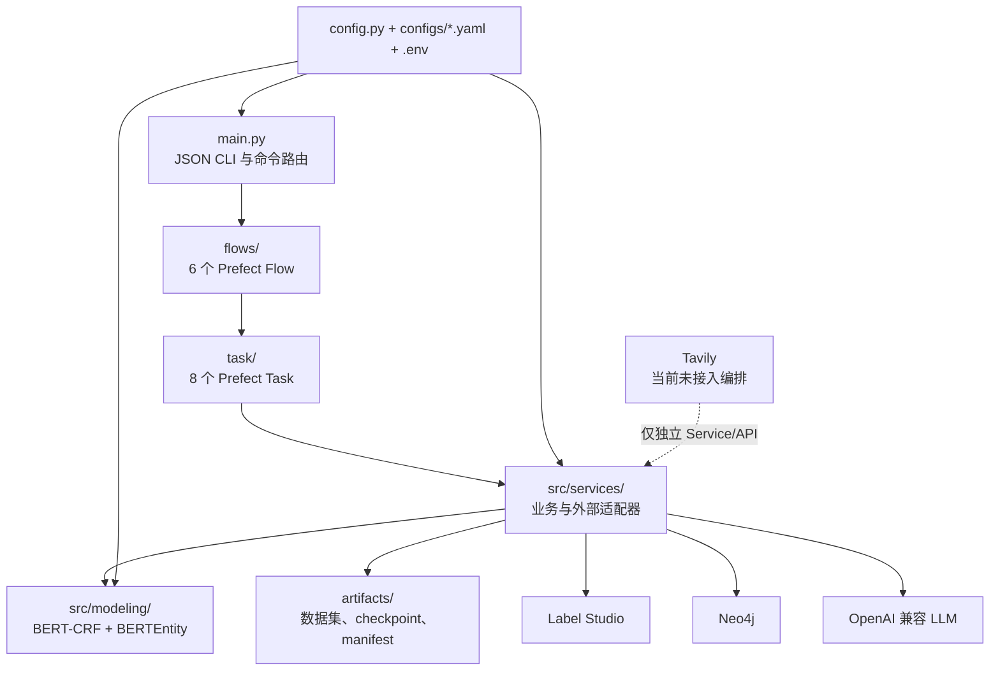
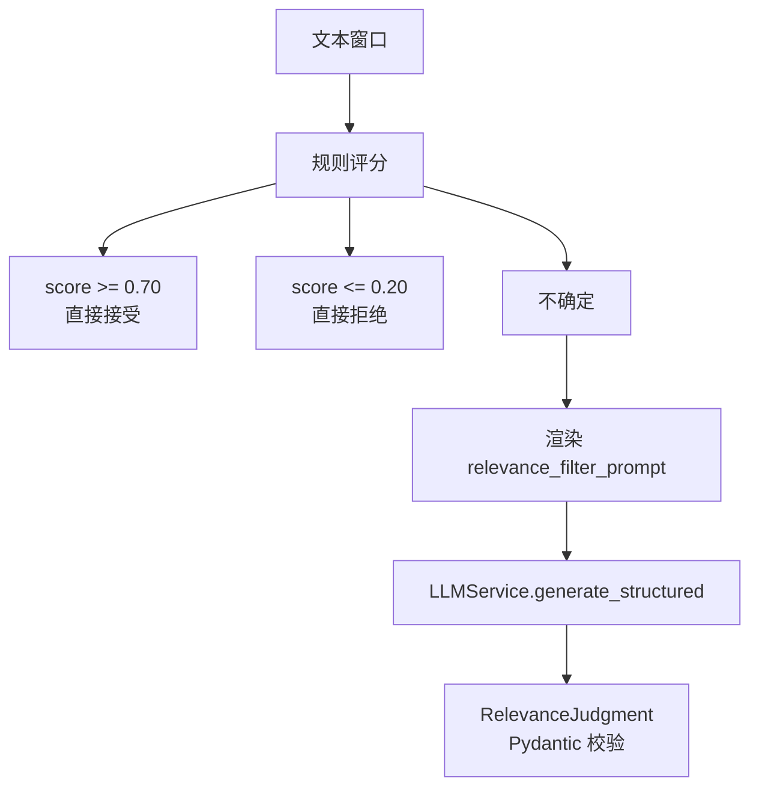
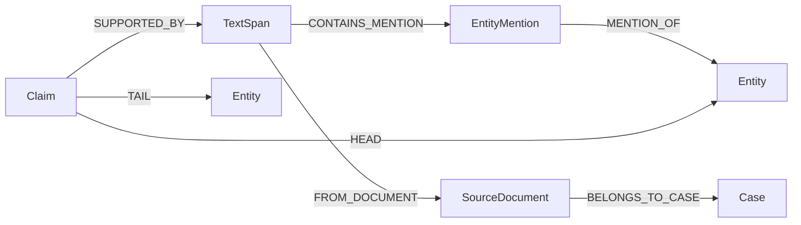
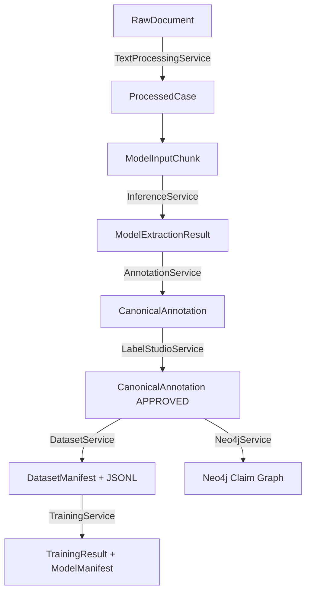
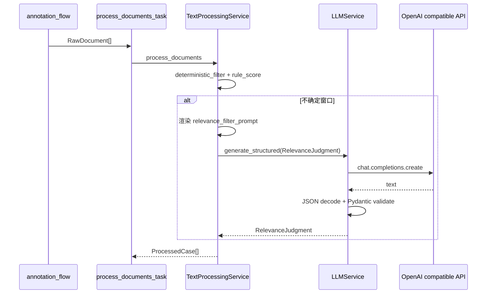
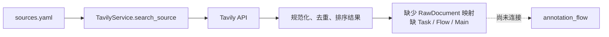

# Agent 项目构建与运行复盘报告

> 审查日期：2026-07-29  
> 审查方式：仅静态扫描；未调用外部 API、未连接 Neo4j/Label Studio、未执行训练、未安装依赖、未修改业务代码。  
> 证据标记：**[事实]** 可由当前代码直接确认；**[推断]** 由多处代码组合得出；**[建议]** 属于改造方案；**[待确认]** 需要运行环境或业务负责人确认。

## 1. 结论先行

这是一个以法律/案件文本为对象的机器学习工程化管线。项目已经具备 Prefect 3 编排入口、文本处理、BERT-CRF 实体识别、BERTEntity 关系分类、规范标注、Label Studio 对接、版本化数据集、双模型训练和 Neo4j Claim 图谱写入能力。

当前的真实完成度不是“所有接口均已形成可直接运行的闭环”，而是：

- **[事实] 已打通的代码主干**：CLI → Flow → Task → Service → 本地模型/文件/外部适配器。
- **[事实] 未接入主干的能力**：Tavily 检索没有 Task、Flow 或 CLI 路由；4 个提示词中只有相关性过滤提示词进入运行时。
- **[事实] 默认配置无法直接完成原始文档到训练的闭环**：模型 checkpoint 为空时，文本块会被标为不可推理；即使生成标注，数据集服务只接受 `APPROVED` 标注，而默认总流程不开启人审同步。
- **[事实] 没有“渐进式披露/迭代检索”机制**：不存在依据上一轮新信息扩展查询、维护轮次状态并按停止条件收敛的循环。
- **[推断] 项目更接近“可测试的模块化批处理系统”，还不是一个自主规划、循环检索、持续修正的 Agent 系统。**

## 2. 扫描范围与统计口径

扫描了项目根目录下 Python、YAML、Jinja2、测试和依赖文件，并读取 `.env` 的变量名但未读取或输出变量值。排除了缓存、虚拟环境、构建产物和运行时 artifact。

| 对象 | 数量 | 口径 |
|---|---:|---|
| 分析输入文件 | 73 | 72 个可见有效文件 + `.env` 变量名元数据 |
| 有效目录 | 12 | 不含根目录、缓存与产物目录 |
| 空文件 | 0 | 当前扫描范围内 |
| Prefect Flow | 6 | `@flow` 定义 |
| Prefect Task | 8 | `@task` 定义 |
| Service | 9 | `src/services/*_service.py` 中的主服务类 |
| Prompt | 4 | `prompts/*.jinja2` |
| 生产模型/枚举 | 85 | 生产代码中的 Pydantic `BaseModel` 与业务 `Enum` 声明 |
| 配置项 | 273 | 252 个 YAML 叶子项 + 21 个环境设置字段；列表按一个叶子项计 |
| 运行时未接入文件 | 3 | 3 个配置且被测试、但无生产调用者的提示词模板 |
| 架构问题 | 15 | 见第 13 节，按独立根因计数 |

全局还扫描了 `TODO`、`FIXME`、`NotImplementedError` 和独立 `pass`：没有发现生产功能占位。生产代码中的 `pass` 位于容错清理/忽略无效字符的异常分支，测试中的 `pass` 是 fake client 方法体，不计为空文件或占位功能。

## 3. 系统业务定位

**[事实]** `models.py` 定义了案件、来源文档、文本块、实体、关系、规范标注、数据集版本、训练结果和工作流状态等领域对象（`models.py:15-426`）。`configs/schema.yaml` 定义实体与关系 schema；`configs/workflow.yaml` 定义过滤、标注、数据集和提示词配置；`configs/training.yaml` 定义 NER/关系模型训练与推理配置；`configs/graph.yaml` 定义 Claim 中心图谱配置。

**[推断]** 业务目标是把案件相关的非结构化文本转为可追溯的实体关系标注，经人工审核后沉淀训练数据，再训练模型并写入知识图谱。

## 4. 总体架构



### 分层职责

- `main.py`：解析 JSON 输入、按命令构造请求、调用 Flow、序列化结果和设置退出码（`main.py:63-308`）。
- `flows/`：表达阶段顺序和跨阶段数据传递，不直接实现领域逻辑。
- `task/`：建立 Prefect 可观测边界、超时和有限重试，实例化/关闭 Service。
- `src/services/`：文本处理、推理、标注、外部系统适配、数据集、训练与图谱逻辑。
- `src/modeling/`：模型、Dataset、Predictor、Trainer、指标和 checkpoint manifest。
- `models.py`：跨层共享的领域契约。
- `config.py`：统一加载环境变量和 5 个 YAML 文件（`config.py:16-185`）。

## 5. 程序入口与运行模式

### 5.1 CLI

**[事实]** `main.py` 提供 6 个命令：

| 命令 | Flow | 输入 |
|---|---|---|
| `annotation` | `annotation_flow` | 标注任务或原始文档 |
| `review-sync` | `review_sync_flow` | 项目 ID、任务 ID |
| `dataset-build` | `dataset_build_flow` | 已审核标注 |
| `training` | `training_flow` | 数据集版本、模型类型 |
| `graph-ingestion` | `graph_ingestion_flow` | 标注及来源/案件映射 |
| `ingestion` | `ingestion_flow` | 多阶段总请求 |

命令路由位于 `main.py:169-198`；总流程适配器位于 `main.py:201-209`；参数解析、输入来源、顶层 `asyncio.run`、JSON 输出及退出码位于 `main.py:281-308`。

输入可以来自：

1. `--input-file` 指定的 JSON 文件；
2. 标准输入；
3. 命令行内联 JSON。

**[事实]** 顶层 CLI 只在程序边界调用一次 `asyncio.run`，没有在已运行事件循环内嵌套启动事件循环。

### 5.2 Prefect 运行

所有 Flow 都可以直接由 Python/Prefect 调用，不依赖 CLI。仓库中没有 deployment、work pool、worker、schedule 或 `prefect.yaml` 定义。  
**[待确认]** 生产环境是否由仓库外的 Prefect Server/Cloud 配置负责部署与调度。

## 6. 真实主链路


总编排在 `flows/ingestion_flow.py:33-145`：

1. 可选执行标注；
2. 可选同步人审；
3. 可选构建数据集；
4. 可选依次训练 NER 和关系模型；
5. 可选写入图谱；
6. 返回阶段结果摘要。

### 默认参数的关键冲突

**[事实]**

- 总流程默认 `run_annotation=True`、`run_dataset_build=True`；
- 默认 `run_review_sync=False`；
- `AnnotationService` 输出 `GENERATED` 或 `PENDING_REVIEW`（`src/services/annotation_service.py:47-164`）；
- `DatasetService` 严格要求 `AnnotationStatus.APPROVED`（`src/services/dataset_service.py:423-555`）。

因此，**[推断] 默认“原始文档 → 标注 → 数据集”调用会在数据集校验阶段失败**，除非输入本身含已审核标注，或显式开启并成功完成 review sync。

## 7. 各阶段实现审查

### 7.1 检索

`TavilyService` 支持：

- 普通搜索、按来源关键词组合搜索、时间范围过滤；
- URL 规范化、结果去重、按分数排序；
- Tavily extract；
- 服务内部指数退避重试。

证据：`src/services/tavily_service.py:96-413`。

但它只被测试和可选独立调用：

- 没有对应 Prefect Task；
- 没有对应 Flow；
- `main.py` 没有检索命令；
- `ingestion_flow` 不会调用它。

**[结论]** 检索能力存在，但业务链尚未接入。“来源配置 → 自动采集 → 后续处理”不是当前可执行闭环。

### 7.2 文档解析、清洗与切分

`TextProcessingService` 是文本入口（`src/services/text_processing_service.py:251-1475`）：

- 支持纯文本、Markdown、HTML、DOCX、PDF；
- 统一换行、移除零宽/控制字符、压缩无意义空白；
- 按段落和句子边界切分；
- 先做确定性过滤，再对不确定窗口调用 LLM；
- 合并相关文本跨度，扩展证据上下文；
- 优先按 tokenizer token 窗口构建模型输入，无法加载 tokenizer 时退化为字符窗口；
- 批处理由 `asyncio.Semaphore` 控制并发，默认最大并发 4。

关键默认值来自 `configs/workflow.yaml:77-158`：

| 参数 | 默认值 |
|---|---:|
| 相关性目标窗口 | 800 字符 |
| 最大窗口 | 1200 字符 |
| 窗口重叠 | 150 字符 |
| 自动接受阈值 | 0.70 |
| 自动拒绝阈值 | 0.20 |
| 模型最大 token | 480 |
| 模型 token 重叠 | 64 |
| 字符回退窗口 | 800 |
| 批处理并发 | 4 |

#### 切分算法

1. 相关性窗口按句边界累计，到目标长度后停止，必要时对超长句做固定字符滑窗（`src/services/text_processing_service.py:654-738,1455-1475`）。
2. 相关跨度按重叠或间隔不超过 80 字符合并（`src/services/text_processing_service.py:779-846`）。
3. 模型输入优先按 tokenizer offset 和句边界切分；超长句按 480 token、64 token overlap 滑动（`src/services/text_processing_service.py:1026-1117`）。
4. tokenizer 不可用时退化为字符区间（`src/services/text_processing_service.py:1119-1212`）。

**[事实]** 当前没有语义切分、递归切分或标题层级切分；实现的是句边界优先的滑动窗口。

### 7.3 相关性判定与 LLM

确定性过滤会检查最小长度、标题术语、页面类型、来源/域名及显式元数据；规则得分由正负关键词加权后截断到 `[0,1]`（`src/services/text_processing_service.py:596-738`）。

只有“不确定”窗口会进入 LLM：



调用位置：`src/services/text_processing_service.py:750-777,1227-1268`。  
结构化输出解析：`src/services/llm_service.py:314-371`，会从响应中寻找第一个合法 JSON 对象/数组，再由 Pydantic 校验。

**[事实]** 同步 OpenAI 兼容客户端通过 `asyncio.to_thread` 从异步文本流程调用，避免直接阻塞事件循环。

### 7.4 模型推理

`InferenceService.extract_batch` 执行：

1. 懒加载 BERT-CRF Predictor；
2. 识别实体；
3. 构建可分类的实体对；
4. 懒加载 BERTEntity Predictor；
5. 输出实体与关系候选。

证据：`src/services/inference_service.py:29-222`，候选构建见 `src/modeling/bert_entity/candidate_builder.py`。

**[事实]** BERT-CRF Predictor 自己还会使用 tokenizer overflow/stride 处理超长输入（`src/modeling/bert_crf/predictor.py:100-146`）。

**[事实]** `configs/training.yaml` 中两类运行时 checkpoint 路径当前为空。文本服务加载不到本地 fast tokenizer 时会产生 `model_ready=False` 的回退块，而 `annotation_flow` 只把 `model_ready=True` 的块送入推理（`flows/annotation_flow.py:38-113`）。

**[推断]** 在未提供可用本地模型目录时，原始文档可能被处理但没有任何块进入标注，表现为“流程成功但零标注”，或者在显式模型输入路径上加载 checkpoint 失败。

### 7.5 规范标注与人审

`AnnotationService.to_canonical` 负责：

- 实体去重、offset/文本一致性校验；
- 关系端点、类型、证据范围校验；
- 低置信度与异常标志；
- 生成规范 `CanonicalAnnotation`。

证据：`src/services/annotation_service.py:47-164`。

Label Studio 适配器负责构造预测 payload、批量导入、读取最新有效人工标注并转换为 `APPROVED` 规范标注（`src/services/label_studio_service.py:132-654`）。

**[事实]** 发布和同步 Task 配置了 2 次重试，仅对 `LabelStudioConnectionError` 生效（`task/annotation_tasks.py:84-115`、`task/review_tasks.py:38-67`）。

### 7.6 数据集

`DatasetService.create_dataset_version` 执行：

1. 严格校验审核状态、offset、类型、关系方向和证据；
2. 标注去重；
3. 以案件为隔离单位做可复现 train/validation/test 切分；
4. 冻结已有 test 集；
5. 导出 BIO NER JSONL 和 OpenNRE 风格关系 JSONL；
6. 写入源标注、统计、schema 快照、checksum 和 manifest；
7. 临时目录完成后原子移动为正式版本。

证据：`src/services/dataset_service.py:334-731,1281-1580`。

**[事实]** 关系样本的实体位置使用左闭右开 offset；切分不会让同一案件跨集合。

### 7.7 模型训练

`TrainingService` 只协调两个 Trainer 并记录 manifest（`src/services/training_service.py:20-155`）。

- BERT-CRF：真实 PyTorch 训练循环、梯度裁剪、评估、保存 Hugging Face 模型/tokenizer/标签映射（`src/modeling/bert_crf/trainer.py:47-105`）。
- BERTEntity：交叉熵训练、梯度裁剪、评估、保存 `model.pth.tar`、tokenizer 和关系映射（`src/modeling/bert_entity/trainer.py:48-132`）。
- `training_flow` 对所选模型类型顺序执行，不并行（`flows/training_flow.py:23-61`）。

**[事实]** 当前训练循环没有 scheduler、early stopping、混合精度、梯度累积或最佳 epoch checkpoint；只在全部 epoch 完成后保存一次。

### 7.8 Neo4j 图谱

图谱采用 Claim 中心建模：



`Neo4jService`：

- 长期复用官方 Driver，并显式关闭；
- `CREATE ... IF NOT EXISTS` 幂等初始化约束和索引；
- 使用 `MERGE` 幂等 upsert Case、Document、TextSpan、Entity、Mention、Claim；
- 单标注一个事务，批量模式每批一个独立事务；
- 支持只读查询防护、健康检查和写入后验证。

证据：`src/services/neo4j_service.py:285-480,784-919,1308-1478,1650-1760,1868-1915,2184-2228`。

## 8. Prefect 编排清单

### Flow

| Flow | 同步性 | 主要职责 |
|---|---|---|
| `annotation_flow` | async | 文档处理、推理、规范标注、可选发布 |
| `review_sync_flow` | sync | 同步 Label Studio 已审核结果 |
| `dataset_build_flow` | sync | 构建版本化数据集 |
| `training_flow` | sync | 顺序训练一个或两个模型 |
| `graph_ingestion_flow` | sync | 写入 Neo4j |
| `ingestion_flow` | async | 总流程条件编排 |

### Task

| Task | timeout | retries | 重试边界 |
|---|---:|---:|---|
| `process_documents_task` | 1800s | 0 | 无 |
| `inference_task` | 3600s | 0 | 无 |
| `annotation_task` | 600s | 0 | 无 |
| `publish_annotations_task` | 600s | 2 | Label Studio 连接异常 |
| `review_sync_task` | 600s | 2 | Label Studio 连接异常 |
| `dataset_build_task` | 3600s | 0 | 无 |
| `training_task` | 86400s | 0 | 无 |
| `graph_ingestion_task` | 1800s | 2 | Neo4j 连接/瞬态写异常 |

**[事实]** 未配置 Task cache、持久化 result storage、显式 concurrency limit、task mapping 或 Flow 级 recovery 策略。代码也没有把 `WorkflowState` 用作持久化断点。

## 9. 配置、模型与提示词

### 配置来源

加载顺序由 `config.py:126-185` 控制：

- `.env` → `EnvironmentSettings`；
- `configs/schema.yaml`；
- `configs/sources.yaml`；
- `configs/workflow.yaml`；
- `configs/training.yaml`；
- `configs/graph.yaml`。

### `.env` 静态契约

只检查了变量名。当前文件包含 OpenAI、Tavily、SerpAPI、Qdrant、Neo4j 和 Embedding 相关变量。

**[事实]** `EnvironmentSettings` 实际读取 `LLM_API_KEY`、`LLM_BASE_URL`、`LLM_MODEL_ID` 等名称，而当前 `.env` 提供的是 `OPENAI_API_KEY`；Qdrant、SerpAPI 和 Embedding 变量没有对应代码读取者。Neo4j 的部分高级字段由代码期待，但 `.env` 中未声明。

### Prompt 使用情况

| Prompt | 配置 | 合同测试 | 生产运行时 |
|---|---|---|---|
| `relevance_filter_prompt.jinja2` | 是 | 是 | **已接入** |
| `canonical_annotation_prompt.jinja2` | 是 | 是 | 未接入 |
| `annotation_repair_prompt.jinja2` | 是 | 是 | 未接入 |
| `conflict_review_prompt.jinja2` | 是 | 是 | 未接入 |

配置位置：`configs/workflow.yaml:60-75`；合同测试：`tests/test_prompt_contracts.py`；唯一运行时渲染器：`src/services/text_processing_service.py:1227-1268`。

## 10. 错误传播、重试、幂等与并发

### 错误传播

- 文档批处理会把单文档异常转换为 `ProcessedCase(status="failed")`，以保留批次其他结果（`src/services/text_processing_service.py:368-388`）。
- Label Studio 批量导入会记录单批错误并继续返回结果；这可能使 Prefect Task 判定为成功。
- Neo4j 默认 `continue_on_error=False`，批次失败会抛出并触发 Task 重试。
- 数据集/训练异常直接向上冒泡，使 Flow 失败。
- CLI 对输入/本地 IO 错误返回退出码 2，对流程失败返回 1（`main.py:281-308`）。

### 幂等

- Neo4j：`MERGE` + 唯一约束，较强。
- 数据集：内容指纹、版本目录、checksum、原子移动，较强。
- Label Studio 发布：未看到业务幂等键；重复运行可能重复导入任务，**[待确认]** Label Studio 端是否有去重策略。
- 模型训练：artifact 目录 `exist_ok=False`，防止覆盖，但不是可恢复训练。

### 并发

- 文档处理内部并发默认 4。
- Flow 中标注任务逐条 `await`，训练 NER/关系模型顺序执行。
- 未使用 Prefect `.map()`、future 批量并发或全局并发限制。

## 11. 渐进式披露专项审查

用户定义的渐进式披露应至少具备：

1. 首轮小范围检索；
2. 基于新信息生成扩展查询；
3. 保存已知事实、待验证点与证据；
4. 多轮循环；
5. 最大轮次、边际收益或置信度停止条件；
6. 查询/结果去重与预算控制。

**[事实] 当前实现不具备上述循环。**

Tavily 的多个固定关键词、文本处理的“规则先判定、不确定再调用 LLM”是分阶段过滤，不是依据新知识主动扩展搜索的渐进式披露。因此本报告不绘制虚构的循环状态图。

**[建议]** 若业务确需该机制，可新增 `RetrievalState`、`retrieval_round_task` 和 `progressive_retrieval_flow`，状态至少包含：

- `round_index`、`queries_seen`、`urls_seen`；
- `facts`、`open_questions`、`evidence_refs`；
- `new_information_gain`、`remaining_budget`；
- 停止条件：最大轮次、连续低增益、无新 URL、预算耗尽或置信度达标。

## 12. 测试与可观测性

测试覆盖：

- Prefect Flow/Task 和 `main.py` 路由；
- 两类 Predictor；
- 9 个 Service 的核心路径；
- Prompt 合同；
- Tavily 适配器。

测试目录见 `tests/`。本次遵循静态分析约束，没有执行测试，因此不在报告中声明运行通过率。

日志主要使用 Python `logging` 和 Prefect 运行日志。业务对象含 trace 字段、manifest 和 checksum，但没有统一 trace ID、指标上报、OpenTelemetry 或告警配置。

## 13. 架构问题清单

| # | 严重度 | 已确认问题 | 影响 | 证据 |
|---:|---|---|---|---|
| 1 | 高 | 默认总流程跳过人审却默认构建数据集 | 生成标注不是 `APPROVED`，默认链路失败 | `flows/ingestion_flow.py:33-145`; `src/services/dataset_service.py:423-555` |
| 2 | 高 | 默认 checkpoint 路径为空 | 原始文档无法进入真实推理或产生零标注 | `configs/training.yaml:49-87`; `flows/annotation_flow.py:38-113` |
| 3 | 高 | `requirements.txt` 缺少实际运行依赖 | 新环境无法运行 LLM、Tavily、Neo4j、Label Studio、Torch/Transformers、PDF 路径 | `requirements.txt:1-4` 与各 Service 可选导入 |
| 4 | 高 | `.env` 与 `EnvironmentSettings` 命名不一致 | LLM 配置表面存在但代码读取为空 | `.env` 变量名；`config.py:16-61` |
| 5 | 中 | Tavily 检索未接入 Task/Flow/CLI | 无法形成自动采集闭环 | `src/services/tavily_service.py`; `main.py:169-198` |
| 6 | 中 | 3 个 Prompt 无生产调用者 | 配置与测试给出“已接入”错觉 | `configs/workflow.yaml:60-75`; `tests/test_prompt_contracts.py` |
| 7 | 中 | LLM 客户端关闭内部重试，但上层文本 Task 也无重试 | 暂时性 LLM 故障只会形成 partial/failed 文档，不会按声明重试 | `src/services/llm_service.py:108-192`; `task/parsing_tasks.py:19-48` |
| 8 | 高 | Label Studio 导入在批内吞掉异常并返回结果 | Prefect Task 的重试条件可能永远看不到连接失败 | `src/services/label_studio_service.py:300-378`; `task/annotation_tasks.py:84-115` |
| 9 | 中 | review sync 结果只在内存向下游传递 | 单独同步后没有仓库内持久化恢复点 | `src/services/label_studio_service.py:380-654` |
| 10 | 中 | `WorkflowState` 等状态模型未用于运行时 | 没有显式断点续跑和阶段恢复 | `models.py:379-426`; 全局调用扫描 |
| 11 | 中 | 配置存在重复与未消费项 | 调参可能无效或上下层取值不一致 | `configs/workflow.yaml`; `configs/training.yaml`; Service 配置构造器 |
| 12 | 中 | Flow 主要顺序执行，未利用 Prefect 并行映射 | 大批量文档/标注吞吐受限 | `flows/annotation_flow.py:38-113`; `flows/training_flow.py:23-61` |
| 13 | 中 | 关系方向违规时标注服务加 flag 但仍保留关系 | 无效关系延迟到数据集阶段才失败 | `src/services/annotation_service.py:96-154` |
| 14 | 高 | tokenizer 回退块被标为不可推理并被静默过滤 | 文本处理有结果但标注数量为零，定位困难 | `src/services/text_processing_service.py:848-930,1180-1212`; `flows/annotation_flow.py:65-83` |
| 15 | 中 | 没有渐进检索、查询扩展、向量检索或 QA 主链 | 与“Agent/知识发现”目标存在能力缺口；`.env` 中 Qdrant 配置未被使用 | 全局调用扫描；`.env` 变量名 |

## 14. 优先改造建议

### P0：让当前闭环可预测地运行

1. **[建议]** 在 `main.py`/`ingestion_flow` 启动前做 preflight：校验所选阶段需要的 checkpoint、环境变量、目录和外部适配器依赖。
2. **[建议]** 调整默认阶段组合：未同步审核时默认不构建严格数据集；或要求请求显式提供 `APPROVED` 标注。
3. **[建议]** 补齐并按 extra 分组依赖，例如 `core`、`ml`、`integrations`、`documents`。
4. **[建议]** 统一 `LLM_*`/`OPENAI_*` 命名，并对未消费环境变量给出启动告警。
5. **[建议]** Label Studio 批次只要出现可重试连接错误就向 Task 抛出；业务拒绝类错误再记录为部分失败。

### P1：补齐编排和恢复能力

1. 新增 retrieval Task/Flow，并明确是否属于总 ingestion 的首阶段。
2. 将文档/标注分片提交为 Prefect future 或 `.map()`，同时用 concurrency limit 保护 GPU、LLM 和外部 API。
3. 将每阶段输入指纹、输出 artifact URI 和状态持久化；总流程只传引用，不传大型对象。
4. 为发布 Label Studio 增加业务幂等键；为训练增加 resume/best-checkpoint。
5. 把未接入 Prompt 接到明确的 Task，或删除配置以缩小真实系统表面。

### P2：向 Agent 化演进

1. 建立渐进检索状态机，而不是简单追加关键词。
2. 引入证据账本：每个事实必须关联 URL、文档版本、文本 offset 和提取轮次。
3. 把 Qdrant/Embedding 作为可选检索层接入，并定义关键词、向量和图谱检索的融合排序。
4. 增加 QA/验证 Flow，用 Claim 与证据跨度回答问题，而不是直接查询裸实体关系。

## 15. 最终判断

**[事实]** 代码分层清楚，领域模型、数据集可追溯性、模型 artifact 和 Neo4j 幂等写入设计较完整；Prefect Task/Flow 的基本接口已经形成。

**[事实]** 当前最大的实际阻断不是单个算法，而是“默认阶段契约、配置契约、依赖契约”三者没有完全对齐。

**[推断]** 先完成 P0，可把项目从“模块齐全但需要知道隐含前提”提升为“入口可自检、失败可解释的工程管线”；再做 P1/P2，才适合称为具备持续检索与恢复能力的 Agent 系统。

## 16. 待读取运行环境后确认

- Prefect Server/Cloud 是否在仓库外配置 result storage、deployment 和 schedule；
- 实际模型 checkpoint 是否由挂载卷或 CI/CD 注入；
- Label Studio 是否在服务端配置了业务去重；
- `.env` 的 OpenAI/Qdrant/Embedding 名称是否供仓库外进程使用；
- Neo4j 的线上 schema 是否与 `_schema_definitions()` 一致；
- 人工审核结果是否由其他系统持久化；
- 生产依赖是否通过未入库的镜像或 lockfile 安装。

## 17. 从业务需求到代码实现的正向映射

### 17.1 原始文档到模型标注

```text
案件文本处理需求
  → RawDocument / ProcessedCase / ModelInputChunk
  → workflow.text_processing 配置
  → relevance_filter_prompt（仅不确定窗口）
  → TextProcessingService
  → process_documents_task
  → annotation_flow
  → main.py: annotation / ingestion

实体与关系抽取需求
  → ExtractedEntity / ExtractedRelation / ModelExtractionResult
  → training.modeling.{ner,relation}
  → 无 LLM Prompt；使用本地深度模型
  → InferenceService + 两类 Predictor
  → inference_task
  → annotation_flow
  → main.py

规范标注需求
  → CanonicalEntity / CanonicalRelation / CanonicalAnnotation
  → schema.yaml + annotation.confidence_threshold
  → 当前不使用 canonical_annotation_prompt
  → AnnotationService
  → annotation_task
  → annotation_flow
  → main.py
```

### 17.2 人审到训练

```text
人工审核需求
  → LabelStudioImportResult / CanonicalAnnotation(APPROVED)
  → LABEL_STUDIO_* + workflow.label_studio
  → 无 LLM Prompt
  → LabelStudioService
  → publish_annotations_task / review_sync_task
  → annotation_flow / review_sync_flow / ingestion_flow
  → main.py

训练数据需求
  → DatasetBuildRequest / DatasetManifest / DatasetBuildResult
  → workflow.dataset + schema.yaml
  → 无 Prompt；必须确定性生成
  → DatasetService
  → dataset_build_task
  → dataset_build_flow / ingestion_flow
  → main.py

模型训练需求
  → TrainingResult / EvaluationResult / ModelManifest
  → training.yaml
  → 无 Prompt
  → TrainingService + BertCrfTrainer + BertEntityTrainer
  → training_task
  → training_flow / ingestion_flow
  → main.py
```

### 17.3 图谱与检索

```text
图谱写入需求
  → CanonicalAnnotation + CaseDocument + SourceDocument
  → graph.yaml + schema.yaml + NEO4J_*
  → 无 Prompt
  → Neo4jService
  → graph_ingestion_task
  → graph_ingestion_flow / ingestion_flow
  → main.py

来源检索需求
  → TavilySearchResult 等 Service 局部模型
  → sources.yaml + TAVILY_API_KEY
  → 无 Prompt
  → TavilyService
  → [缺 Task]
  → [缺 Flow]
  → [缺 main 路由]
```

这组映射说明一个实用判据：如果一项业务能力在 `Model → Config → Service → Task → Flow → Main` 中间断链，就不能仅凭文件存在宣称它已成为项目功能。

## 18. Models 设计复盘

### 18.1 当前跨层模型族

| 模型族 | 代表模型 | 创建阶段 | 消费阶段 | 是否应在初期确定 |
|---|---|---|---|---|
| 来源与案件 | `RawDocument`、`SourceDocument`、`CaseDocument` | 输入/采集 | 文本处理、图谱 | 是 |
| 文本处理 | `ProcessedCase`、`RelevantSpan`、`ModelInputChunk` | parsing | inference | 核心字段应提前确定，算法诊断字段可后补 |
| 模型抽取 | `ExtractedEntity`、`ExtractedRelation`、`ModelExtractionResult` | inference | annotation | 是 |
| 规范标注 | `CanonicalEntity`、`CanonicalRelation`、`CanonicalAnnotation` | annotation/review | Label Studio、Dataset、Neo4j | **必须最早稳定** |
| 数据集 | `DatasetBuildRequest`、`DatasetManifest`、`DatasetBuildResult` | dataset | Trainer、审计 | 输入契约应提前，manifest 细节可实现时确定 |
| 训练 | `TrainingResult`、`EvaluationResult` | Trainer | Flow、manifest、发布 | 核心字段提前，指标字典可逐步扩展 |
| 工作流 | `WorkflowState`、各 Flow Request/Result | Flow | CLI/恢复 | 阶段与状态枚举应提前 |
| 外部适配 | Label Studio/Neo4j/Tavily 局部模型 | Service | Task/测试 | 可在 Service 开发时确定 |

重要声明集中在 `models.py:15-426`；Flow 局部请求/结果见各 `flows/*.py`；外部适配结果模型位于对应 Service 文件。

### 18.2 A：项目初期必须确定

1. `RawDocument`：原文、来源、内容类型、文档/案件标识；
2. `CanonicalAnnotation` 及实体/关系：这是人审、数据集、模型和图谱的共同语言；
3. `AnnotationStatus`、实体类型、关系类型和 offset 约定；
4. 数据集版本与 schema version；
5. 总流程输入、阶段开关和最终状态；
6. 外部副作用的幂等标识。

原因：这些对象跨越三个以上模块，后改会引发数据迁移和 checkpoint/schema 兼容问题。

### 18.3 B：Service 开发时确定

- 文档解析诊断、相关性判断细节；
- Tavily/Label Studio/Neo4j 的传输结果；
- 模型 Predictor 的内部 batch；
- Neo4j counters、schema 初始化结果；
- Trainer 内部 context。

这些模型属于适配器或算法内部，不应过早固化到全局 `models.py`。

### 18.4 C：Task/Flow 编排时确定

- `AnnotationFlowResult`、`TrainingFlowResult`、`IngestionFlowRequest/Result`；
- 阶段是否跳过、部分成功、失败；
- artifact 引用、重试后状态和恢复信息。

当前问题是 `WorkflowState` 虽已定义但没有进入运行链；如果恢复是业务要求，它应与 Flow 一起完成，而不是只定义模型。

### 18.5 D：可以暂用基础类型

- 简单筛选参数、CLI command 字符串；
- Service 内不跨边界的局部计数；
- 第三方 SDK 的原始响应，在适配器内部短暂存在。

不宜继续使用普通 `dict` 的位置：

- `ProjectConfig` 内 5 组 YAML 当前仍是宽泛 `dict[str, Any]`；
- Dataset manifest 的部分嵌套统计；
- Neo4j payload 和训练 context。

**[建议]** 优先把会跨模块、会持久化或会影响兼容性的字典转为强类型；Cypher 参数和 Trainer 局部 context 无需全部模型化。

### 18.6 修改影响示例

| 修改 | 直接影响 | 间接影响 |
|---|---|---|
| `CanonicalEntity.start/end` 语义 | Annotation、Dataset、Label Studio、Neo4j | 两类模型、已有数据 |
| 新增关系类型 | schema、mapping、候选构建 | checkpoint 分类头、Prompt、图谱 |
| 修改 `DatasetManifest` | DatasetService | Trainer、Champion、审计工具 |
| 修改 Flow Result | Flow | `main.py` JSON 输出、编排测试 |

## 19. Config 设计复盘

### 19.1 分类

| 类型 | 当前存放 | 例子 | 应何时确定 |
|---|---|---|---|
| 敏感环境配置 | `.env` → `EnvironmentSettings` | API key、数据库密码 | 外部系统选型后，Service 实现前 |
| 稳定项目配置 | `configs/*.yaml` | schema、窗口、模型、数据集比例、图谱策略 | 跨模块契约确定后 |
| 运行时参数 | `main.py` 请求模型 | doc、dataset version、阶段开关、dry run | 每次运行 |
| 代码级常量 | Enum、正则、协议字段 | 状态值、只读 Cypher 规则 | 协议/算法实现时 |

### 19.2 关键配置追踪

| 配置 | 定义 | 读取 | 默认/现值 | 影响 |
|---|---|---|---|---|
| LLM endpoint/model/key | `config.py:16-61` | `LLMService.__init__` | 环境变量；名称存在错位 | 相关性复核 |
| 相关窗口 | `workflow.yaml:84-104` | `TextProcessingConfig` | 800/1200/150 | LLM 调用量与召回 |
| 模型 token 窗口 | `workflow.yaml:140-147` | `TextProcessingConfig` | 480/64 | 推理上下文与重叠 |
| NER max length/stride | `training.yaml:49-75` | Predictor/Trainer | modeling 配置 | tokenizer overflow |
| Dataset split | `workflow.yaml:33-53` | `DatasetService` | 0.70/0.15/0.15 | 训练可复现性 |
| Label Studio batch | `workflow.yaml:24-31` | `LabelStudioService` | 100 | 发布/同步 |
| Neo4j batch | `graph.yaml:1-10` | `Neo4jService` | 500 | 事务大小 |
| Task timeout/retry | Task 装饰器 | Prefect | 600–86400s / 0–2 | 失败行为 |

### 19.3 已确认的配置问题

- 环境变量名称不一致：`OPENAI_API_KEY` 与 `LLM_API_KEY`；
- `training.yaml` 的顶层 `ner` 与 `modeling.ner` 存在重复参数源；
- `workflow.workflow` 的全局 retry/batch 没有统一驱动 Task 装饰器；
- ingestion 去重、training trigger、annotation repair 等配置没有完整运行者；
- graph 的若干声明性 schema 配置没有替代代码中的固定 Cypher/schema；
- Prefect timeout/retry 硬编码在装饰器，无法仅改 YAML 生效。

## 20. Prompt、Service、Task、Flow 与 Main 职责复盘

### 20.1 Prompt 决策

| 业务功能 | 实际调用函数 | Prompt | 输入 | 输出模型 | 状态 |
|---|---|---|---|---|---|
| 不确定文本相关性复核 | `TextProcessingService.review_uncertain_window` | relevance filter | 来源、窗口、规则理由 | `RelevanceJudgment` | 已运行 |
| 规范标注 | 无生产调用 | canonical annotation | 设计上为文本/schema | 设计为规范标注 JSON | 未接入 |
| 标注修复 | 无生产调用 | annotation repair | 原标注/错误 | 修复 JSON | 未接入 |
| 冲突审核 | 无生产调用 | conflict review | 冲突候选 | 审核 JSON | 未接入 |

判断原则：

- 需要语义判断、规则难以穷举的“不确定相关性”适合 LLM；
- offset 校验、schema 方向、去重、切分、checksum 不应使用 LLM；
- 规范标注可以使用 LLM，但必须置于确定性校验和人工审核之前；
- 修复与冲突判断不能天然等同于审核通过。

当前 Prompt 没有显式版本字段；版本只能从文件内容和配置路径间接推断。4 个模板没有 few-shot 示例。

### 20.2 Service 边界

| Service | 类型 | 输入 → 输出 | 副作用 | Task 调用 |
|---|---|---|---|---|
| TextProcessing | 业务/文档适配 | RawDocument → ProcessedCase | 可读本地文档、可调 LLM | 是 |
| LLM | 外部适配 | messages/schema → 模型/文本 | 远程 API | 间接 |
| Inference | 业务协调 | chunks → extraction | 加载本地模型 | 是 |
| Annotation | 纯业务 | extraction → canonical | 无外部副作用 | 是 |
| LabelStudio | 外部适配 | annotation/query → import/review | 远程读写 | 是 |
| Dataset | 业务+存储 | approved annotations → dataset | 本地文件 | 是 |
| Training | 业务协调 | dataset → training result | checkpoint 文件/GPU | 是 |
| Neo4j | 外部适配+图谱规则 | annotation → graph | 数据库读写 | 是 |
| Tavily | 外部适配 | query/source → search/extract | 远程 API | **否** |

从本项目得到的 Service 划分原则：

- 外部 SDK、文件格式或模型加载需要隔离时建 Service；
- 多个 Task/入口共享的确定性业务规则建 Service；
- 仅用于决定 Task 顺序的逻辑留在 Flow；
- timeout、retry、cache、资源队列属于 Task/Prefect，而不是业务 Service；
- 不要为只有一行纯转换且无独立契约的逻辑机械建 Service。

### 20.3 Task 边界

当前 Task 基本是薄包装，这在项目中是合理的：业务可单测，Prefect 只承担执行边界。应成为 Task 的步骤具有至少一项特征：

- 时间较长；
- 可能独立失败/重试；
- 有外部副作用；
- 需要独立日志、超时、资源限制；
- 能产生可复用 artifact。

普通校验、单个字段转换、窗口内部循环不应拆成 Task，否则会制造大量 Prefect 状态和序列化开销。

### 20.4 Flow 边界

| Flow | 分支/循环/并发 | 数据传递 | 恢复 |
|---|---|---|---|
| annotation | raw/job 分支；逐块顺序；无循环 | 对象列表 | 无显式断点 |
| review sync | 无 | 标注列表 | 无持久化 |
| dataset build | 无 | build result | artifact 自身可追溯 |
| training | 模型类型分支；顺序 | 训练结果字典 | 无 resume |
| graph ingestion | 无 | batch result | Neo4j upsert 幂等 |
| ingestion | 多个布尔阶段分支 | 上一阶段对象直接传递 | 无阶段状态恢复 |

Flow 没有直接实例化外部 Service，层次方向正确。主要不足是大型对象直接跨阶段传递、没有 artifact URI 和恢复状态。

### 20.5 Main 边界

当前 `main.py` 做了合理的：

- 输入来源选择；
- Pydantic 校验；
- Flow 路由；
- JSON 输出；
- 退出码。

它没有直接写图谱、调用模型或实现数据集规则。后续应新增的是 preflight/命令注册，不应把业务逻辑上移。

## 21. 关键运行机制补充

### 21.1 结果去重

- Tavily：规范化 URL 后去重，保留更高分结果；
- Annotation：按实体位置/类型和关系端点/类型去重；
- Dataset：按标注/文本指纹去重；
- NER 跨窗：合并相同或重叠预测；
- Neo4j：以稳定 ID + `MERGE` 去重。

这些不是同一个“通用 dedup”；每层的身份键不同，不宜抽成一个万能工具。

### 21.2 上下文裁剪与压缩

**[事实]** 存在窗口裁剪、相关跨度合并和前后句扩展。  
**[事实]** 不存在 LLM 摘要式上下文压缩、对话记忆窗口或基于信息密度的压缩。

### 21.3 状态传递

当前主要通过 Pydantic 对象在 Flow 内存中传递；Dataset/checkpoint/Neo4j 是持久化终点。`WorkflowState` 没有承担运行时状态机。

### 21.4 滑动窗口复杂度与替换

设文本字符数为 `n`、目标步长为 `s`，字符窗口生成近似 `O(n)`，窗口数约为 `n/s`；tokenizer 处理也与 token 总数近似线性，但 overlap 会增加重复推理比例。

| 替换方案 | 最少修改 | 影响 |
|---|---|---|
| 语义分块 | TextProcessingService + workflow config + tests | 需 embedding/模型依赖；offset 必须保留 |
| 递归字符分块 | TextProcessingService 的 range 构造器 + tests | 改动小；仍需句/段分隔符优先级 |
| 标题分块 | parser 输出结构 + chunk builder + RawDocument 元数据 | DOCX/HTML/Markdown 差异较大 |
| 动态 token 分块 | token range 函数 + model config + tests | 与 Predictor stride、GPU batch 强耦合 |

替换后通常不需要改 Flow/Task 接口，只要 `ModelInputChunk` 契约保持不变；若改变 offset 或输出粒度，则 Annotation、Dataset、Label Studio、Neo4j 全部受影响。

### 21.5 结构化输出修复

当前 LLM 结构化输出只做“寻找首个合法 JSON + Pydantic 校验”，没有自动修复循环。`annotation_repair_prompt` 虽存在，但未调用。因此失败修复属于设计预留，而不是当前机制。

## 22. 如果重新构建：推荐开发顺序

### 第一阶段：画业务流程并标注运行属性

先确定输入/输出、人工节点、外部副作用、失败语义、是否可重试、是否需持久化。当前项目最应该在此阶段明确的是“生成标注不能直接构建严格训练集”。

### 第二阶段：稳定跨模块数据契约

先定义 `RawDocument`、规范实体/关系/标注、审核状态、Dataset 版本、模型 artifact 身份和稳定 ID/offset 规则。

### 第三阶段：确定配置契约

分别列出 secret、项目稳定参数、单次运行参数和代码常量；确定唯一配置源及覆盖优先级，避免 `training.ner` 与 `training.modeling.ner` 双源。

### 第四阶段：确定 Prompt 契约

只为需要非确定性语义判断的节点建立 Prompt；每个 Prompt 同时确定输入变量、输出模型、失败策略、版本和人工审核位置。

### 第五阶段：按依赖实现 Service

推荐顺序：

1. schema/config loader；
2. TextProcessing；
3. Annotation/Dataset 的确定性契约；
4. 模型 Dataset/Predictor/Trainer；
5. Inference/Training 协调；
6. Label Studio、Neo4j、Tavily 外部适配。

每个 Service 与单测同步完成。

### 第六阶段：封装 Task

按外部副作用和长耗时边界封装，明确 timeout、重试异常、幂等键、并发资源与 result storage。

### 第七阶段：编排子 Flow 和总 Flow

先让每个阶段独立运行，再组合总流程；对每条合法分支写编排测试；在此阶段完成状态持久化和恢复，不要留到上线后。

### 第八阶段：建立 Main

只实现命令注册、输入校验、preflight、Flow 启动、结果序列化和退出码。

### 第九阶段：端到端契约测试

使用 fake 外部客户端和微型本地 artifact 验证全链；真实外部系统测试单独标记，不应成为普通单测前提。

## 23. 初始业务设计模板与学习清单

### 23.1 可复用的流程节点模板

```text
节点名称：
业务目的：
进入条件：
输入：
输出：
输入模型：
输出模型：
稳定 ID / offset 约定：
使用配置：
是否使用 LLM：
Prompt 与输出 schema：
本地模型 / 模型版本：
外部服务：
是否有副作用：
幂等键：
失败语义（整体/部分）：
可重试异常：
超时与并发限制：
是否封装为 Service：
是否封装为 Task：
所属 Flow：
状态/结果持久化位置：
恢复键：
日志与指标：
数据敏感等级：
必须测试的边界：
下游兼容风险：
```

### 23.2 初步流程图中就应标注的技术信息

1. 每条边上传递的是对象、ID 还是 artifact URI；
2. 每个节点的强类型输入输出；
3. 哪个状态必须人工改变；
4. 哪些节点调用 LLM、本地模型或远程 API；
5. 每个副作用的幂等键；
6. timeout、重试责任层和不可重试错误；
7. 并发资源类型；
8. 数据落点、版本和恢复键；
9. schema/checkpoint/dataset 的兼容关系；
10. 部分成功是否允许继续。

### 23.3 建议学习顺序

1. 从 `models.py` 理解共同语言；
2. 从 `configs/schema.yaml` 理解业务边界；
3. 从 `flows/ingestion_flow.py` 看总阶段；
4. 从 `flows/annotation_flow.py` 看核心对象如何变换；
5. 深读 `TextProcessingService` 的窗口与 offset；
6. 深读 `InferenceService` 和两个 Predictor；
7. 深读 `AnnotationService` 与 `DatasetService` 的严格契约；
8. 阅读 TrainingService/Trainer 的 artifact 关系；
9. 阅读 Neo4jService 的稳定 ID 和事务；
10. 最后看 Task 与 Main，理解它们为什么应该保持薄。

### 23.4 文件与数据调用图



### 23.5 LLM 调用链



### 23.6 当前检索能力图


