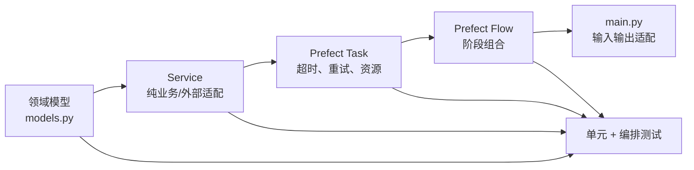

# 模块修改指南

> 目标：回答“某类需求应该改哪里、还会影响哪里、怎么验证”。  
> 原则：先改契约，再改实现，再改编排，最后补测试；避免只改 YAML 或只改入口造成“配置看似生效、实际无人消费”。

## 1. 修改前的共同检查

任何改动开始前先确认：

1. 输入/输出是否已经由 `models.py` 或局部 Pydantic 模型定义；
2. 配置项是否真的被 Service 的配置构造器读取；
3. 业务逻辑应放在 Service，而不是 Flow/Task；
4. Task 是否需要超时、重试、缓存和资源清理；
5. Flow 是否只负责阶段组合；
6. CLI 是否只负责适配请求和结果；
7. 对应单元测试、编排测试、Prompt 合同测试是否需要同步；
8. 是否引入新的外部依赖或环境变量；
9. 是否破坏 artifact、checkpoint、dataset manifest 或 Neo4j schema 的兼容性。

## 2. 增加或修改 CLI 命令

### 应修改

- `main.py`
  - 新增/调整请求 Pydantic 模型；
  - 在 `execute` 中增加命令路由；
  - 在 argparse 的 choices 中注册命令；
  - 保持 JSON 输入/输出。
- `flows/<feature>_flow.py`
  - 新增真正的业务编排入口。
- `flows/__init__.py`
  - 导出新 Flow。
- `tests/test_main.py`
  - 覆盖成功、请求校验失败和 Flow 异常。

### 视情况修改

- `models.py`：跨层复用的新领域对象；
- `task/`：新阶段需要 Prefect 可观测/重试边界时；
- `tests/test_prefect_orchestration.py`：总流程分支变化时。

### 不建议

- 不要在 `main.py` 内直接实例化 Neo4j、模型或外部 API 客户端；
- 不要在入口重复实现 Service 已有校验；
- 不要在同步函数里对已有事件循环调用嵌套 `asyncio.run`。

## 3. 增加新的业务阶段

推荐依赖方向：

### 新阶段模板

1. 在 `models.py` 或 Service 局部定义输入/输出；
2. 在 `src/services/` 实现可独立测试的逻辑；
3. 在 `task/` 包一层 Task，并在 `finally` 关闭客户端/Driver；
4. 在 `flows/` 建立 Flow；
5. 将它接入 `flows/ingestion_flow.py`；
6. 在 `main.py` 暴露独立命令或总流程开关；
7. 添加 Service 单测、Task/Flow 编排测试和 CLI 路由测试。

## 4. 接入 Tavily 检索

当前已有 `src/services/tavily_service.py`，缺少编排层。

### 最小接入面

- 新建 `task/retrieval_tasks.py`
  - 将 `search_source`/`extract` 包成 Task；
  - 明确可重试异常；
  - 设置 API 并发限制与超时。
- 新建 `flows/retrieval_flow.py`
  - 遍历 `configs/sources.yaml`；
  - 输出 `RawDocument`，而不是 Tavily 原始响应。
- 修改 `flows/ingestion_flow.py`
  - 允许 retrieval 输出成为 annotation 的 `raw_documents`。
- 修改 `main.py`
  - 新增 `retrieval` 命令及总流程开关。
- 修改 `task/__init__.py`、`flows/__init__.py`。
- 新增编排测试，复用 `tests/test_tavily_service.py` 的 fake client。

### 必须决定

- URL 去重键和内容指纹；
- 日期边界；
- 搜索结果到 `RawDocument` 的字段映射；
- extract 失败是跳过、部分成功还是 Flow 失败；
- Tavily 内部重试与 Prefect 重试由哪一层负责，避免重试倍增。

## 5. 实现渐进式披露/迭代检索

当前项目不存在该机制。不要把固定关键词循环直接称为渐进式披露。

### 建议新增模型

在 `models.py` 增加：

- `RetrievalFact`：事实、置信度、证据引用；
- `RetrievalQuestion`：待验证问题、优先级；
- `RetrievalRound`：本轮 query、结果、增量信息；
- `RetrievalState`：轮次、已见 query/URL、预算、停止原因。

### 建议新增模块

- `src/services/retrieval_planning_service.py`
  - 根据 `facts + open_questions` 产生下一轮 query；
  - 去重并限制 query 数。
- `task/retrieval_tasks.py`
  - 单轮搜索、extract、事实归并；
- `flows/progressive_retrieval_flow.py`
  - 显式循环与停止条件；
  - 每轮持久化状态 artifact。

### 停止条件至少包含

- `round_index >= max_rounds`；
- 没有新 URL；
- 连续 N 轮信息增益低于阈值；
- API/token 预算耗尽；
- 关键问题全部达到置信度；
- 人工中止。

### 验证重点

- query 和 URL 去重；
- 同一事实的证据合并；
- 循环一定终止；
- 失败后从最后完整轮次恢复；
- LLM 不能凭空生成无证据 query 结论。

## 6. 修改文本解析、清洗或切分

### 主要文件

- `src/services/text_processing_service.py`
- `configs/workflow.yaml`
- `tests/services/test_text_processing_service.py`

### 影响面

- `ProcessedCase`、`RelevantSpan`、`ModelInputChunk`；
- 实体字符 offset；
- BERT tokenizer 最大长度；
- Label Studio 中的可视文本；
- Dataset BIO 对齐；
- Neo4j evidence offset。

### 修改规则

- 清洗导致字符删除/替换时，必须维护 source ↔ cleaned offset 映射；
- 重叠窗口合并必须保持确定性；
- 字符区间统一使用左闭右开；
- 不要把 `model_ready=False` 当普通成功静默丢弃，至少返回计数和原因；
- 修改 `model_max_tokens` 时同时检查 NER Predictor 的 `max_length/stride`。

### 必测边界

- 中文标点、英文缩写、小数点；
- 超长单句；
- 多段落、空白和零宽字符；
- HTML/DOCX/PDF；
- 窗口首尾实体；
- overlap 区域重复实体；
- tokenizer 不存在或不是 fast tokenizer；
- 单文档失败不污染同批其他文档。

## 7. 修改相关性判定或 LLM 调用

### 主要文件

- `prompts/relevance_filter_prompt.jinja2`
- `src/services/text_processing_service.py`
- `src/services/llm_service.py`
- `configs/workflow.yaml`
- `tests/test_prompt_contracts.py`
- `tests/services/test_llm_service.py`
- `tests/services/test_text_processing_service.py`

### 契约

Prompt 输出必须能被 `RelevanceJudgment` 校验；证据 offset 是窗口内局部 offset，Service 会转换为全文 offset。

### 修改注意

- 新增 Prompt 变量必须同步合同测试和渲染参数；
- 不要只在 YAML 中注册 Prompt，必须有生产调用者；
- 保持温度、模型、最大 token 和 timeout 可配置；
- 明确 LLM 失败策略：`partial`、跳过、重试还是中止；
- 当前 OpenAI client 设置 `max_retries=0`，若由 Prefect 统一重试，应把 LLM 调用放进具备重试语义的 Task。

## 8. 接入另外三个 Prompt

### 规范标注 Prompt

- 调用点建议放在 `AnnotationService` 的独立方法；
- 用专门 Task 包装 LLM 调用；
- 输出先经过严格 Pydantic/schema/offset 校验；
- 不要覆盖深度模型结果，应保存模型版本与 Prompt 版本。

### 修复 Prompt

- 输入必须包含原输出、结构化校验错误和最大修复次数；
- 每次修复保留审计记录；
- 达到次数上限转人工，不要无限递归。

### 冲突审核 Prompt

- 输入包括两套标注、各自来源、置信度和证据；
- 输出只作为建议，不能自动标记 `APPROVED`，除非业务明确允许。

## 9. 修改领域 schema

### 主要文件

- `configs/schema.yaml`
- `models.py`
- `src/modeling/common/label_mapping.py`
- `src/services/annotation_service.py`
- `src/services/dataset_service.py`
- `src/modeling/bert_entity/candidate_builder.py`
- `src/services/neo4j_service.py`
- 4 个 Prompt 及合同测试

### 风险

schema 变化会同时影响：

- 旧标注能否读取；
- BIO 标签映射；
- 关系分类输出维度；
- checkpoint 是否兼容；
- 关系方向规则；
- Dataset manifest；
- Neo4j 标签和 Claim 属性；
- Label Studio 标签配置。

### 推荐流程

1. 提升 `schema_version`；
2. 写迁移/兼容策略；
3. 重新生成 mapping；
4. 阻止旧 checkpoint 与新 schema 混用；
5. 创建新 dataset version；
6. 重新训练并评估；
7. 再决定是否写入现有图谱或新数据库。

## 10. 修改实体识别模型

### 主要文件

- `src/modeling/bert_crf/model.py`
- `src/modeling/bert_crf/dataset.py`
- `src/modeling/bert_crf/predictor.py`
- `src/modeling/bert_crf/trainer.py`
- `configs/training.yaml`

### 联动文件

- `src/modeling/common/model_manifest.py`
- `src/modeling/common/label_mapping.py`
- `src/modeling/common/offset_mapping.py`
- `src/services/inference_service.py`
- `src/services/text_processing_service.py`
- `tests/modeling/test_bert_crf_predictor.py`

### 兼容条件

- artifact 必须包含模型权重、tokenizer、`label_map.json` 和 `model_manifest.json`；
- manifest 的 architecture/schema/model version 应与运行时一致；
- Predictor 的 stride 与前置文本切块不要产生不可控重复；
- 新模型输出必须保持全文字符 offset，不要只返回 token offset。

## 11. 修改关系分类模型

### 主要文件

- `src/modeling/bert_entity/model.py`
- `src/modeling/bert_entity/dataset.py`
- `src/modeling/bert_entity/candidate_builder.py`
- `src/modeling/bert_entity/predictor.py`
- `src/modeling/bert_entity/trainer.py`
- `configs/training.yaml`

### 影响面

- schema 中的方向约束；
- 负类 `无关系`；
- OpenNRE JSONL 格式；
- `relation_map.json`；
- checkpoint 分类头维度；
- AnnotationService 和 DatasetService 校验。

### 必测

- 正反向实体对；
- 不允许的类型组合；
- 头尾实体同一/重叠；
- 负类；
- checkpoint 与 relation mapping 不匹配；
- 批量顺序与输入候选一一对应。

## 12. 修改训练流程

### 主要文件

- `flows/training_flow.py`
- `task/training_tasks.py`
- `src/services/training_service.py`
- 两类 `trainer.py`
- `configs/training.yaml`

### 若增加 early stopping/scheduler

- Trainer 记录每 epoch 指标；
- 保存 best 和 last checkpoint；
- manifest 写入 best epoch、监控指标和停止原因；
- 恢复训练时保存 optimizer/scheduler/scaler 状态；
- 训练 Task 的重试不能从零覆盖已有目录。

### 若并行训练两个模型

- 使用 Prefect future/submit，而不是在 Flow 内自己开线程；
- 为 GPU 配置 concurrency limit；
- 明确两个训练是否共享 GPU/CPU/磁盘；
- 汇总时保持 NER/Relation 结果键稳定。

## 13. 修改数据集格式或切分

### 主要文件

- `src/services/dataset_service.py`
- `configs/workflow.yaml` 的 `dataset`
- `src/modeling/bert_crf/dataset.py`
- `src/modeling/bert_entity/dataset.py`
- 两类 Trainer
- `tests/services/test_dataset_service.py`

### 不变量

- 仅接受业务认可状态；
- 同一案件不得跨 train/validation/test；
- test 集冻结策略必须确定；
- offset 左闭右开；
- manifest 必须记录 schema、来源、随机种子、样本数和 checksum；
- 已发布版本不可原地悄悄改变。

### 配置陷阱

新增 YAML 字段后，必须在 `DatasetService` 的配置构造器中显式读取，并写测试证明行为变化；仅添加字段不会自动生效。

## 14. 修改 Label Studio 对接

### 主要文件

- `src/services/label_studio_service.py`
- `task/annotation_tasks.py`
- `task/review_tasks.py`
- `flows/annotation_flow.py`
- `flows/review_sync_flow.py`
- `configs/workflow.yaml`
- `config.py`

### 重点

- 预测导入与人工审核同步是两个方向；
- 字段名必须与 Label Studio 项目 labeling config 一致；
- 任务重复发布需要幂等键；
- 网络异常应向 Task 抛出以触发重试；
- 单条业务格式错误可记录为部分失败；
- 人审同步结果需要持久化 artifact，才能断点恢复和审计。

### 环境变量

检查 `LABEL_STUDIO_URL`、`LABEL_STUDIO_API_KEY`、`LABEL_STUDIO_PROJECT_ID` 是否与 `EnvironmentSettings` 一致，不要把密钥写入 YAML。

## 15. 修改 Neo4j 图谱

### 主要文件

- `src/services/neo4j_service.py`
- `configs/graph.yaml`
- `configs/schema.yaml`
- `task/graph_tasks.py`
- `tests/services/test_neo4j_service.py`

### 图谱不变量

- `Case.case_id`、`SourceDocument.doc_version_id`、`TextSpan.text_uid`、`Entity.entity_uid`、`EntityMention.mention_uid`、`Claim.claim_id` 必须稳定；
- upsert 使用参数化 Cypher；
- 动态标签必须来自受控白名单；
- 单批次事务要么完整提交，要么完整回滚；
- 只读查询入口继续禁止写关键字；
- schema 变更使用 `IF NOT EXISTS`，并考虑旧索引/约束迁移。

### 配置陷阱

当前部分 graph YAML 表达的是设计意图，Neo4jService 内仍有固定 schema/Cypher。修改 `node_types` 或 `claim` 配置前，先确认代码是否实际消费对应键。

## 16. 修改环境变量与依赖

### 环境变量

修改顺序：

1. `config.py::EnvironmentSettings`；
2. `.env.example`（当前仓库缺少，建议新增，但不要提交真实 `.env`）；
3. 使用该字段的 Service；
4. 启动 preflight；
5. 配置测试。

当前应优先统一：

- `LLM_API_KEY` 与 `OPENAI_API_KEY`；
- Neo4j transaction retry/fetch size；
- Label Studio；
- Tavily；
- 未使用的 Qdrant/Embedding/SerpAPI 变量。

### 依赖

当前 `requirements.txt` 只有核心 4 项。若要让全链可安装，至少按实际功能审查：

- LLM：`openai`、`jinja2`；
- 检索：`tavily-python`；
- 图谱：`neo4j`；
- 标注：`label-studio-sdk`；
- 模型：`torch`、`transformers` 及 CRF 实现；
- 文档：DOCX/PDF/HTML 解析依赖。

建议用 extras 或多个 requirements 文件，避免轻量编排环境被迫安装 GPU 依赖。

## 17. 修改 Prefect 重试、缓存和并发

### 重试

只重试可恢复异常：

- 网络超时、连接重置、Neo4j transient error；
- 不重试 schema 校验、缺 checkpoint、输入格式错误。

Service 必须把底层异常映射到稳定的业务异常类型，Task 的 `retry_condition_fn` 才能可靠判断。

### 缓存

适合缓存：

- 内容指纹稳定的文档解析；
- 固定模型版本 + 固定文本的推理；
- 只读检索结果（需 TTL）。

不适合直接缓存：

- Label Studio 发布；
- Neo4j 写入；
- 训练；
- 人审同步。

### 并发

建议分别设置：

- LLM/API 并发；
- GPU 推理并发；
- GPU 训练并发；
- Neo4j 写并发；
- 文档 CPU 解析并发。

不要只依赖 `TextProcessingService` 内部 semaphore；Prefect worker 之间还需要全局限制。

## 18. 增加断点续跑

当前 `WorkflowState` 没有运行时使用者。

建议每阶段落盘/持久化：

| 阶段 | 恢复键 | 持久化内容 |
|---|---|---|
| retrieval | source + query + 时间范围 | URL、内容 hash、原始响应引用 |
| parsing | document hash + parser version | ProcessedCase artifact |
| inference | chunk hash + model version | ModelExtractionResult |
| annotation | extraction hash + schema version | CanonicalAnnotation |
| review | Label Studio task/annotation ID | APPROVED 标注 |
| dataset | annotation fingerprint | DatasetManifest |
| training | dataset + config fingerprint | checkpoint/optimizer/manifest |
| graph | annotation ID + schema version | ingestion counters/status |

Flow 恢复时应检查 artifact 完整性和版本，不要只按“文件存在”跳过。

## 19. 测试选择指南

| 改动类型 | 最少应运行 |
|---|---|
| CLI/请求模型 | `tests/test_main.py` |
| Flow/Task | `tests/test_prefect_orchestration.py` + 对应 Service 测试 |
| Prompt | `tests/test_prompt_contracts.py` + LLM/调用 Service 测试 |
| 文本处理 | `tests/services/test_text_processing_service.py` |
| NER | `tests/modeling/test_bert_crf_predictor.py` + Inference 测试 |
| 关系模型 | `tests/modeling/test_bert_entity_predictor.py` + Inference 测试 |
| 标注 | Annotation + Dataset 测试 |
| Label Studio | Label Studio + Prefect 编排测试 |
| 数据集 | Dataset + 两类 Dataset/Trainer 相关测试 |
| 图谱 | Neo4j + Prefect 编排测试 |
| 配置/依赖 | 全量测试 + 最小干净环境 import smoke test |

## 20. 提交前检查表

- [ ] 新配置有真实消费者和测试；
- [ ] 新环境变量不包含硬编码密钥；
- [ ] 新外部调用有 timeout、错误映射和资源关闭；
- [ ] Task 重试不会放大非幂等副作用；
- [ ] Flow 没有混入领域实现；
- [ ] offset、ID、schema version 和 artifact 兼容性已确认；
- [ ] 默认参数组合本身可运行，或能在 preflight 阶段给出明确错误；
- [ ] 部分失败与整体失败语义一致；
- [ ] 日志不输出密钥、完整敏感文本或认证头；
- [ ] 对应测试与文档已更新。

## 21. 推荐的最小改造顺序

1. 统一环境变量并补 preflight；
2. 修正默认“未人审却构建数据集”的阶段组合；
3. 补齐依赖声明；
4. 让 tokenizer/checkpoint 不可用时显式失败或明确返回原因；
5. 修正 Label Studio 异常传播；
6. 接入 retrieval Task/Flow/CLI；
7. 持久化阶段状态并支持恢复；
8. 再实现渐进式检索、向量检索和 QA。

## 22. 需求名称快速修改索引

下表使用需求中的原始名称，便于直接检索。每一项均应遵循“模型/配置 → Service → Task → Flow → Main → 测试”的顺序，只修改实际受影响层。

| 修改需求 | 核心文件 | 配置/模型/Prompt | 测试与主要风险 |
|---|---|---|---|
| 修改检索方式 | `src/services/tavily_service.py`；未来 retrieval Task/Flow | `configs/sources.yaml`；检索结果模型 | `tests/test_tavily_service.py`；URL/内容去重与 API 重试 |
| 修改滑动窗口 | `TextProcessingService` 的 window/range 函数 | `workflow.text_processing.relevance_window/model_input`；`ModelInputChunk` | 文本处理测试；offset、重复推理、token 上限 |
| 修改文档分块 | `src/services/text_processing_service.py` | workflow 文本参数；`ProcessedCase/RelevantSpan/ModelInputChunk` | 文本处理测试；下游模型与证据 offset |
| 修改渐进式披露策略 | 新建 planning Service、retrieval Task/Flow | 新 `RetrievalState`；轮次/预算/停止配置；可选规划 Prompt | 新状态机测试；无限循环、无证据结论、成本失控 |
| 修改 LLM 模型/提供商 | `src/services/llm_service.py` | `EnvironmentSettings`；`LLM_*`；Prompt 不应因 SDK 改变 | LLM + 调用 Service 测试；异常映射和响应兼容 |
| 修改 Prompt | 对应 `prompts/*.jinja2` 与真实调用 Service | `workflow.prompts`；对应输出 Pydantic 模型 | Prompt 合同 + Service 测试；变量/JSON schema 破坏 |
| 修改结构化输出 | `LLMService.generate_structured/_parse_json` 与调用 Service | 输出模型；可选 repair Prompt | `test_llm_service.py`；宽松解析误接受、修复循环 |
| 修改数据模型 | `models.py` 或 Service 局部模型 | schema/config 版本；序列化调用方 | 全部消费者测试；历史 artifact 和 API 兼容 |
| 修改 Neo4j Schema | `src/services/neo4j_service.py` | `configs/graph.yaml`、`configs/schema.yaml` | Neo4j 测试；约束迁移、稳定 ID、旧图兼容 |
| 修改 Label Studio 同步 | `src/services/label_studio_service.py` | `workflow.label_studio`、`LABEL_STUDIO_*`、CanonicalAnnotation | Label Studio + 编排测试；重复发布与审核状态 |
| 修改数据集构建 | `src/services/dataset_service.py` | `workflow.dataset`、schema、DatasetManifest | Dataset + Trainer 测试；切分泄漏与版本不可变性 |
| 修改训练流程 | `flows/training_flow.py`、TrainingService、Trainer | `training.yaml`、TrainingResult/ModelManifest | 训练服务/模型测试；checkpoint 恢复与 GPU 并发 |
| 新增 Task | `task/<feature>_tasks.py`、`task/__init__.py` | 输入输出模型、超时/重试/并发 | 编排测试；副作用重试幂等 |
| 新增 Flow | `flows/<feature>_flow.py`、`flows/__init__.py` | Flow Request/Result | 编排测试；分支、失败传播、恢复 |
| 新增业务流程 | Models → Service → Task → Flow → `main.py` | 新配置/Prompt 按需添加 | 单元、编排、CLI 三层测试；避免断链 |
| 修改 Main 启动方式 | `main.py` | 请求模型、preflight、输入/输出协议 | `tests/test_main.py`；不要把业务逻辑搬进入口 |

### 通用建议修改顺序

1. 写清新旧输入/输出和兼容策略；
2. 修改强类型模型与版本；
3. 修改并验证配置读取；
4. 修改 Prompt（仅在确实调用 LLM 时）；
5. 修改 Service；
6. 调整 Task 的执行语义；
7. 调整 Flow 分支和状态传递；
8. 最后调整 Main；
9. 从单元测试到编排/CLI 测试逐层验证。
