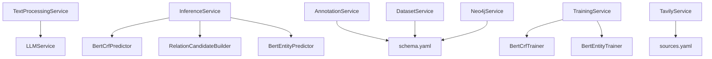

# 项目文件索引

> 生成日期：2026-07-29  
> 口径：扫描 72 个可见有效文件，并仅检查 `.env` 的变量名；不含缓存、虚拟环境、运行产物。  
> 状态说明：**主链**＝被 CLI/Flow/Task 生产路径调用；**独立能力**＝可直接调用但未接主链；**测试**＝只用于验证；**未接入**＝配置存在但无生产调用者。

## 1. 目录地图

```text
.
├── config.py
├── main.py
├── models.py
├── requirements.txt
├── .env
├── configs/                 # schema、来源、流程、训练、图谱配置
├── flows/                   # Prefect Flow
├── prompts/                 # Jinja2 提示词
├── src/
│   ├── modeling/
│   │   ├── common/
│   │   ├── bert_crf/
│   │   └── bert_entity/
│   └── services/
├── task/                    # Prefect Task
└── tests/
    ├── modeling/
    └── services/
```

## 2. 根目录

| 文件 | 角色 | 关键内容 | 主要调用者/状态 |
|---|---|---|---|
| `.env` | 环境变量 | LLM/OpenAI、Tavily、SerpAPI、Qdrant、Neo4j、Embedding 变量名 | `config.py` 只消费其中一部分；值未纳入报告 |
| `config.py` | 配置聚合 | `EnvironmentSettings`、`ProjectConfig`、`load_project_config` | 几乎所有 Service、Trainer、Predictor；主链 |
| `main.py` | 统一 CLI | 6 个请求模型、`execute`、`run_ingestion`、`main` | 用户/进程入口；主链 |
| `models.py` | 领域契约 | 文档、块、实体、关系、标注、数据集、训练、工作流状态 | Flow/Task/Service/Modeling；主链 |
| `requirements.txt` | 最小依赖声明 | Prefect、Pydantic、PyYAML、dotenv | 安装入口；当前未覆盖全部运行时依赖 |
| `AGENT_PROJECT_REVIEW.md` | 架构报告 | 全链路审查、风险和建议 | 本次生成 |
| `PROJECT_FILE_INDEX.md` | 文件索引 | 全部有效文件职责与依赖方向 | 本次生成 |
| `MODULE_CHANGE_GUIDE.md` | 修改指南 | 按需求定位修改面与验证面 | 本次生成 |

## 3. 配置文件

| 文件 | 角色 | 关键配置 | 消费者 |
|---|---|---|---|
| `configs/schema.yaml` | 领域 schema | schema 版本、4 类实体、关系类型、负类 | Annotation、Dataset、Inference、Neo4j、模型映射 |
| `configs/sources.yaml` | 来源白名单 | 来源、域名、关键词、日期/抓取参数 | TextProcessing、Tavily |
| `configs/workflow.yaml` | 流程配置 | ingestion、相关性、标注、Label Studio、数据集、Prompt、文本处理 | 多数 Service |
| `configs/training.yaml` | 模型配置 | NER、关系模型、评估、晋级、推理 artifact | Trainer、Predictor、TrainingService |
| `configs/graph.yaml` | 图谱配置 | Neo4j、Claim 模型、节点类型、实体消歧 | Neo4jService |

## 4. Flow

| 文件 | 声明 | 输入 → 输出 | 下游 |
|---|---|---|---|
| `flows/__init__.py` | Flow 导出 | 模块聚合 | `main.py`、测试 |
| `flows/annotation_flow.py` | `AnnotationFlowResult`、`annotation_flow` | `AnnotationJob/RawDocument` → 规范标注与发布结果 | parsing、inference、annotation Tasks |
| `flows/review_sync_flow.py` | `review_sync_flow` | Label Studio 查询条件 → 已审核标注 | review Task |
| `flows/dataset_build_flow.py` | `dataset_build_flow` | 已审核标注 → `DatasetBuildResult` | dataset Task |
| `flows/training_flow.py` | `TrainingFlowResult`、`training_flow` | 数据集版本/模型类型 → 训练结果 | training Task |
| `flows/graph_ingestion_flow.py` | `graph_ingestion_flow` | 标注及来源映射 → Neo4j 批次结果 | graph Task |
| `flows/ingestion_flow.py` | `IngestionFlowRequest/Result`、`ingestion_flow` | 多阶段请求 → 阶段汇总 | 其余 5 个 Flow |

## 5. Prefect Task

| 文件 | Task | Service 边界 | 资源处理 |
|---|---|---|---|
| `task/__init__.py` | Task 导出 | 聚合模块 | 无 |
| `task/parsing_tasks.py` | `process_documents_task` | `TextProcessingService` | async；关闭 LLM client |
| `task/ingestion_tasks.py` | `inference_task` | `InferenceService` | 任务内懒加载本地模型 |
| `task/annotation_tasks.py` | `annotation_task`、`publish_annotations_task` | Annotation、Label Studio | 发布 Task 有条件重试 |
| `task/review_tasks.py` | `review_sync_task` | `LabelStudioService` | 条件重试 |
| `task/dataset_tasks.py` | `dataset_build_task` | `DatasetService` | 本地文件 artifact |
| `task/training_tasks.py` | `training_task` | `TrainingService` | 最长超时 24 小时 |
| `task/graph_tasks.py` | `graph_ingestion_task` | `Neo4jService` | `finally` 关闭 Driver；条件重试 |

## 6. Service

| 文件 | 主类 | 主要职责 | 状态 |
|---|---|---|---|
| `src/services/text_processing_service.py` | `TextProcessingService` | 文档解析、清洗、相关性窗口、LLM 复核、模型切块、并发批处理 | 主链 |
| `src/services/llm_service.py` | `LLMService` | OpenAI 兼容 chat、结构化输出解析、Pydantic 校验 | 主链，仅相关性复核 |
| `src/services/inference_service.py` | `InferenceService` | NER → 候选构建 → 关系分类 | 主链 |
| `src/services/annotation_service.py` | `AnnotationService` | 模型结果转规范标注、校验、去重、风险标志 | 主链 |
| `src/services/label_studio_service.py` | `LabelStudioService` | 预测 payload、批量导入、人工审核同步 | 主链/可选阶段 |
| `src/services/dataset_service.py` | `DatasetService` | 校验、去重、按案件切分、JSONL 导出、manifest/checksum | 主链 |
| `src/services/training_service.py` | `TrainingService` | 协调两类 Trainer、评估、Champion 查询、manifest | 主链 |
| `src/services/neo4j_service.py` | `Neo4jService` | Driver 生命周期、schema、Claim 图谱 upsert/query/validate | 主链/可选阶段 |
| `src/services/tavily_service.py` | `TavilyService` | 搜索、来源检索、去重、extract、退避重试 | **独立能力，未接 Flow/Task/CLI** |

### Service 依赖方向



## 7. Modeling 公共组件

| 文件 | 声明/职责 | 调用者 |
|---|---|---|
| `src/modeling/__init__.py` | modeling 包标记/导出 | Python 包加载 |
| `src/modeling/common/__init__.py` | common 导出 | 两类模型 |
| `src/modeling/common/device.py` | 设备选择与可用性处理 | Trainer、Predictor |
| `src/modeling/common/label_mapping.py` | schema ↔ 标签/关系 ID 映射 | Dataset、Trainer、Predictor |
| `src/modeling/common/model_manifest.py` | `ModelManifest` 保存/加载/校验 | TrainingService、Predictor、Trainer |
| `src/modeling/common/offset_mapping.py` | 字符/token offset 映射与窗口合并 | NER 数据和推理 |

## 8. BERT-CRF 模块

| 文件 | 角色 | 关键内容 | 调用者 |
|---|---|---|---|
| `src/modeling/bert_crf/__init__.py` | 包导出 | Model、Predictor、Trainer 等 | Inference/Training |
| `src/modeling/bert_crf/model.py` | 模型 | BERT encoder + CRF、loss、decode | Trainer、Predictor |
| `src/modeling/bert_crf/dataset.py` | 数据集 | BIO JSONL → tokenizer 特征/标签对齐 | Trainer |
| `src/modeling/bert_crf/predictor.py` | 推理器 | artifact 加载、overflow/stride NER、跨窗合并 | InferenceService |
| `src/modeling/bert_crf/trainer.py` | 训练器 | PyTorch 循环、梯度裁剪、评估、保存 artifact | TrainingService |
| `src/modeling/bert_crf/metrics.py` | 指标 | token/entity 评估 | Trainer |
| `src/modeling/bert_crf/cli.py` | 独立模型 CLI | 训练/评估/预测入口 | 命令行独立能力；不由 `main.py` 路由 |

## 9. BERTEntity 模块

| 文件 | 角色 | 关键内容 | 调用者 |
|---|---|---|---|
| `src/modeling/bert_entity/__init__.py` | 包导出 | Model、Predictor、Trainer 等 | Inference/Training |
| `src/modeling/bert_entity/model.py` | 模型 | 实体位置感知的关系分类模型 | Trainer、Predictor |
| `src/modeling/bert_entity/dataset.py` | 数据集 | OpenNRE JSONL → token/实体位置特征 | Trainer |
| `src/modeling/bert_entity/candidate_builder.py` | 候选构建 | 根据 schema 方向约束构建实体对 | InferenceService |
| `src/modeling/bert_entity/predictor.py` | 推理器 | artifact 加载、批量关系分类 | InferenceService |
| `src/modeling/bert_entity/trainer.py` | 训练器 | 交叉熵训练、评估、保存 checkpoint | TrainingService |
| `src/modeling/bert_entity/metrics.py` | 指标 | 关系分类指标 | Trainer |
| `src/modeling/bert_entity/cli.py` | 独立模型 CLI | 训练/评估/预测入口 | 命令行独立能力；不由 `main.py` 路由 |

## 10. Prompt

| 文件 | 输入/输出契约 | 运行状态 |
|---|---|---|
| `prompts/relevance_filter_prompt.jinja2` | 文本窗口 → 相关性判断与局部证据 offset | **主链**：TextProcessingService 渲染 |
| `prompts/canonical_annotation_prompt.jinja2` | 文本/schema → 规范实体关系标注 | **未接入生产运行时** |
| `prompts/annotation_repair_prompt.jinja2` | 原标注及错误 → 修复标注 | **未接入生产运行时** |
| `prompts/conflict_review_prompt.jinja2` | 冲突标注 → 审核结论 | **未接入生产运行时** |

## 11. 顶层测试

| 文件 | 验证范围 |
|---|---|
| `tests/test_main.py` | 6 个命令路由、输入与退出行为 |
| `tests/test_prefect_orchestration.py` | Flow/Task 组合、分支和失败传播 |
| `tests/test_prompt_contracts.py` | 4 个 Prompt 的变量和输出合同 |
| `tests/test_tavily_service.py` | Tavily 搜索、去重、日期、重试、错误映射 |

## 12. Service 测试

| 文件 | 验证范围 |
|---|---|
| `tests/services/test_text_processing_service.py` | 解析、清洗、窗口、offset、相关性、并发/失败 |
| `tests/services/test_llm_service.py` | chat、结构化 JSON、错误和配置 |
| `tests/services/test_inference_service.py` | 双模型组合与输出契约 |
| `tests/services/test_annotation_service.py` | 规范化、校验、关系规则、置信度 |
| `tests/services/test_label_studio_service.py` | payload、导入、同步、错误映射 |
| `tests/services/test_dataset_service.py` | 校验、去重、切分、导出、manifest |
| `tests/services/test_training_service.py` | Trainer 协调、artifact manifest、Champion |
| `tests/services/test_neo4j_service.py` | Driver、Cypher、事务、schema、查询安全 |

## 13. Modeling 测试

| 文件 | 验证范围 |
|---|---|
| `tests/modeling/test_bert_crf_predictor.py` | artifact 加载、窗口推理、实体 offset/合并 |
| `tests/modeling/test_bert_entity_predictor.py` | checkpoint、候选批处理、关系分类 |

## 14. 入口到文件的反向索引

| 需求入口 | 首要文件 | 紧邻修改面 |
|---|---|---|
| 增加 CLI 命令 | `main.py` | 对应 `flows/*`、`tests/test_main.py` |
| 调整总流程阶段 | `flows/ingestion_flow.py` | 请求/结果模型、各子 Flow、Prefect 测试 |
| 调整 Task 超时/重试 | `task/*_tasks.py` | Service 异常类型、编排测试 |
| 调整领域字段 | `models.py` | Service、Flow 请求/结果、测试、序列化 |
| 调整实体/关系 schema | `configs/schema.yaml` | Annotation、Dataset、Modeling 映射、Neo4j、Prompt |
| 调整文本切分 | `src/services/text_processing_service.py` | `configs/workflow.yaml`、文本处理测试 |
| 调整推理链 | `src/services/inference_service.py` | 两个 Predictor、候选构建、推理测试 |
| 调整数据格式 | `src/services/dataset_service.py` | 两类 Dataset/Trainer、数据集测试 |
| 调整训练 | 对应 `trainer.py` | `configs/training.yaml`、TrainingService、测试 |
| 调整图谱 | `src/services/neo4j_service.py` | `configs/graph.yaml`、schema、图谱测试 |
| 接入检索 | `src/services/tavily_service.py` | 新 Task/Flow、`main.py`、sources 配置 |
| 调整 LLM Prompt | 对应 `.jinja2` | 调用 Service、workflow 配置、Prompt 合同测试 |

## 15. 未接入与非主链文件说明

严格按“生产运行时无调用者”统计，当前有 3 个未接入文件：

1. `prompts/canonical_annotation_prompt.jinja2`
2. `prompts/annotation_repair_prompt.jinja2`
3. `prompts/conflict_review_prompt.jinja2`

`src/services/tavily_service.py` 和两个模型 `cli.py` 不计入“未使用”，因为它们各自提供可直接调用的独立接口并有测试；但它们不属于 `main.py → ingestion_flow` 主链。

## 16. 阅读顺序

建议首次接手按以下顺序阅读：

1. `models.py`
2. `configs/schema.yaml`
3. `configs/workflow.yaml`
4. `main.py`
5. `flows/ingestion_flow.py`
6. `flows/annotation_flow.py`
7. `src/services/text_processing_service.py`
8. `src/services/inference_service.py`
9. `src/services/annotation_service.py`
10. `src/services/dataset_service.py`
11. `src/services/training_service.py`
12. `src/services/neo4j_service.py`
13. 对应 Task 与测试文件
